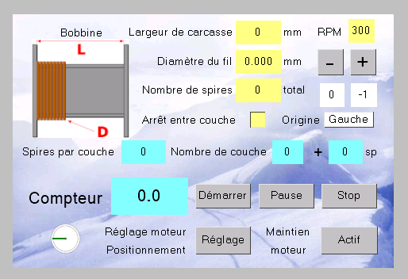
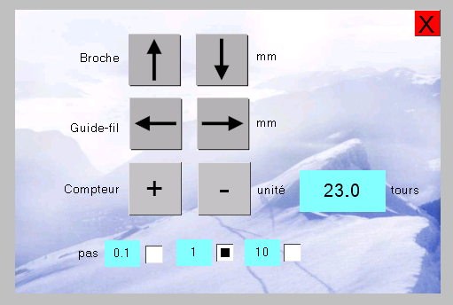
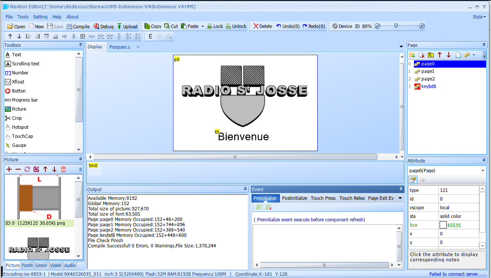
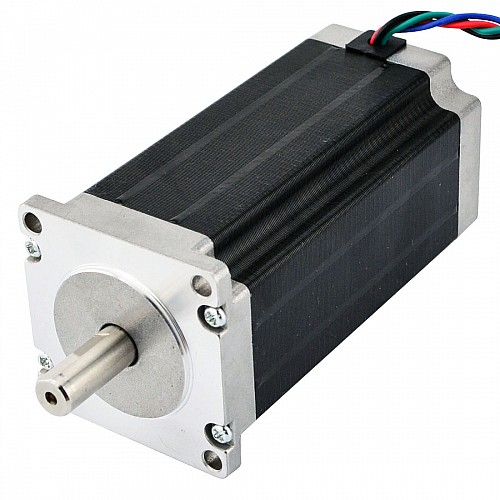
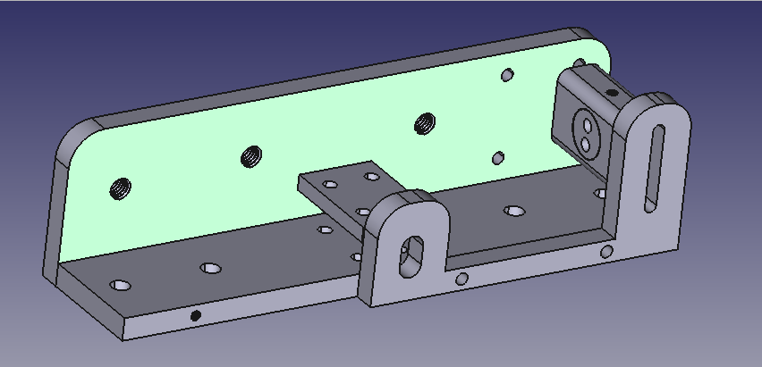
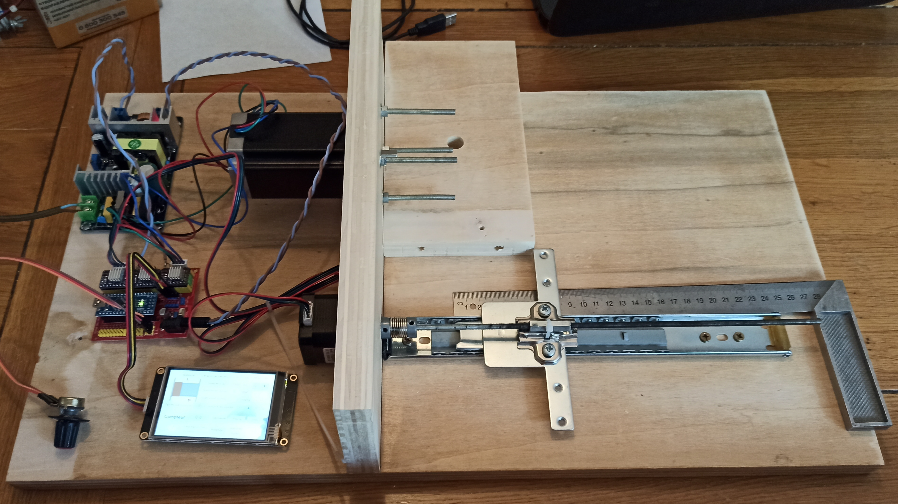
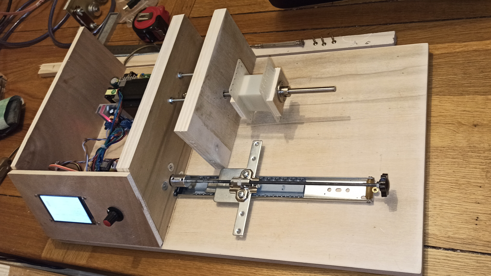
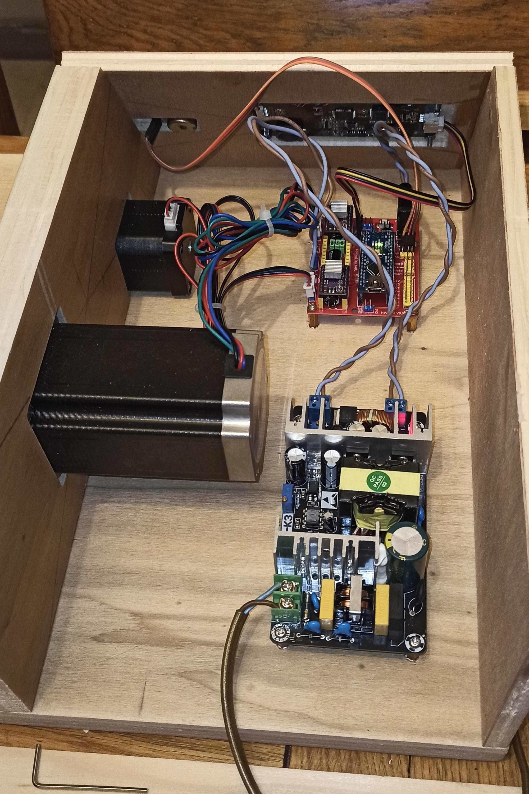

Bobineuse_V4
============

The project describes a stand-alone coil winder

If you would have more information about this project please visit 
www.audiyofan.org

A link to the dedicated post 

http://www.audiyofan.org/forum/viewtopic.php?f=73&t=10075

Parts are very simple

The prototype of the display made with a Nextion touchscreen

A view of the IDE to create the HMI

the motor part uses two stepper motor Nema 23 and Nema 17
and a shield similar to this card

In the folder Freecad some works about the mechanical part

The guide wire

But also some other interresting part made with my CNC to build it

Some picture of the work in progress

Here the function than my program include and which seems to me appropriate

 1° automatic counting from zero to a specified number of turns
 
 2° automatic reversing guide wire depending on the number of turns per layer and change side
 
 3° Speed adjustement wit a potentiometer from 10 to 300 turns per minute
 
 4° Acceleration at the begin and deceleration at the end for each layer

 5° manual correction of errors in advance of the guide wire, losses step essentially
 
 6° management parameters with a touchscreen display
 
 
See in the arduino folder for the sketch

All comments are welcome

Totof
